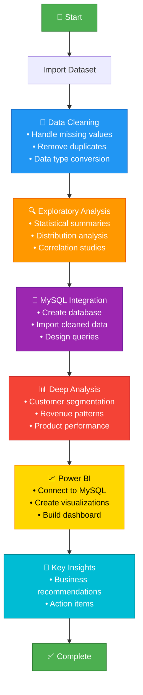
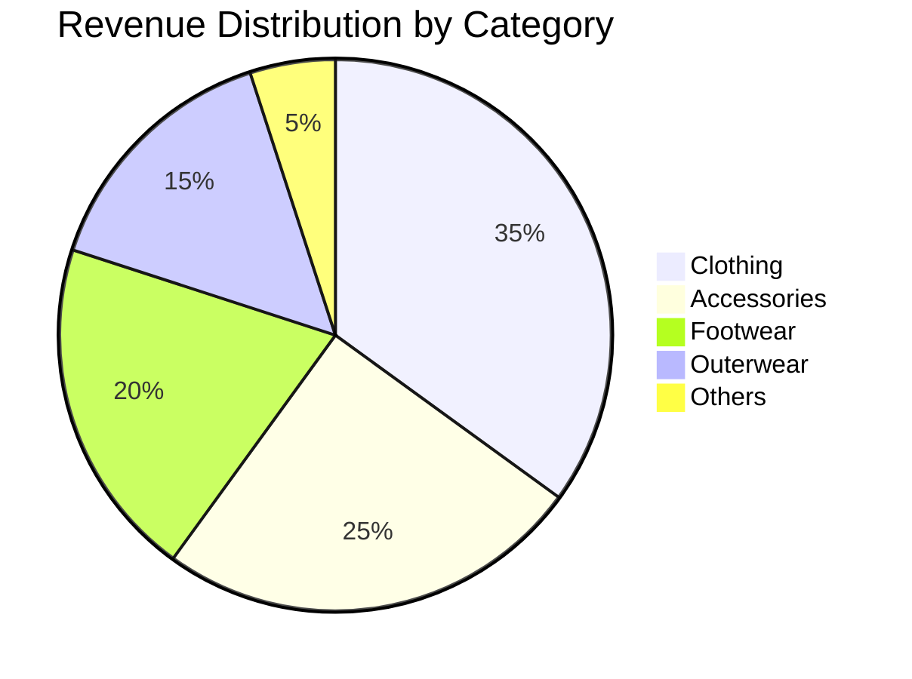
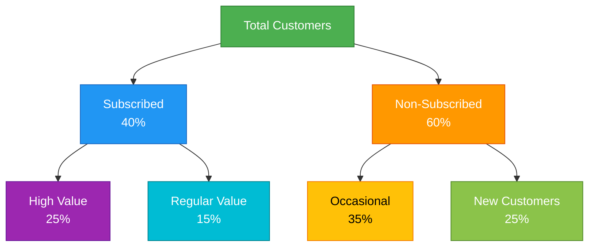

<div align="center">

# 🛒 Customer Behaviour Analysis

### End-to-End Data Analytics Project

[](https://www.python.org/)
[](https://www.mysql.com/)
[](https://powerbi.microsoft.com/)
[](LICENSE)

**Uncovering E-Commerce Insights Through Data-Driven Analysis**

[View Project](#project-overview) • [Dataset](#dataset-summary) • [Analysis](#analysis-workflow) • [Results](#key-insights)

</div>

---

## 📊 Project Overview

This project analyzes **customer shopping behavior** using transactional data from **3,900 purchases** across various product categories. The goal is to uncover actionable insights into:

<div align="center">

| Focus Area | Objective |
|------------|----------|
| 👥 **Customer Patterns** | Understand purchasing behaviors and demographics |
| 💰 **Revenue Analysis** | Identify top-performing products and categories |
| 🎯 **Marketing Impact** | Study the effectiveness of discounts and subscriptions |
| 📊 **Engagement Metrics** | Compare customer segments and loyalty factors |
| 📊 **Business Intelligence** | Create interactive dashboards for strategic decisions |

</div>

---

## 🛠️ Tech Stack

```mermaid
graph LR
    A[🗃️ Raw Data<br/>CSV Files] --> B[🐍 Python<br/>Data Cleaning]
    B --> C[📊 Pandas/NumPy<br/>EDA & Analysis]
    C --> D[💾 MySQL<br/>Data Storage]
    D --> E[🗑️ SQL Queries<br/>Data Extraction]
    E --> F[📊 Power BI<br/>Visualization]
    F --> G[📱 Interactive<br/>Dashboard]
    
    style A fill:#E3F2FD,stroke:#1976D2,color:#000
    style B fill:#FFF3E0,stroke:#F57C00,color:#000
    style C fill:#FFF3E0,stroke:#F57C00,color:#000
    style D fill:#E8F5E9,stroke:#388E3C,color:#000
    style E fill:#E8F5E9,stroke:#388E3C,color:#000
    style F fill:#FFF9C4,stroke:#F9A825,color:#000
    style G fill:#C8E6C9,stroke:#66BB6A,color:#000
```



---

## 📊 Analysis Workflow



---

## 📁 Dataset Summary

<div align="center">

| 📋 Attribute | 📊 Details |
|-----------|----------|
| **Total Records** | 3,900 transactions |
| **Columns** | 18 features |
| **Date Range** | Full year data |
| **Missing Values** | 37 in Review_Rating (handled) |
| **Data Quality** | Clean & processed |

</div>

### 📂 Key Features:

<details>
<summary><b>Click to expand dataset columns</b></summary>

- **Customer Information**
  - `Customer_ID`: Unique identifier
  - `Age`: Customer age
  - `Gender`: Male/Female
  - `Location`: Geographic data

- **Purchase Details**
  - `Item_Purchased`: Product name
  - `Category`: Product category
  - `Purchase_Amount`: Transaction value (USD)
  - `Season`: Purchase season

- **Behavioral Metrics**
  - `Subscription_Status`: Yes/No
  - `Discount_Applied`: Yes/No
  - `Promo_Code_Used`: Yes/No
  - `Previous_Purchases`: Historical count
  - `Frequency_of_Purchases`: Purchase frequency

- **Engagement**
  - `Review_Rating`: 1-5 stars
  - `Shipping_Type`: Delivery method
  - `Payment_Method`: Payment type

</details>

---

## 🔍 Key Insights

### 📈 Revenue Analysis



### 👥 Customer Segmentation



---

## 🛠️ Tools & Technologies

<div align="center">

| Tool | Purpose | Version |
|------|---------|--------|
| 🐍 **Python** | Data processing & analysis | 3.8+ |
| 📦 **Pandas** | Data manipulation | Latest |
| 📈 **NumPy** | Numerical computing | Latest |
| 📉 **Matplotlib** | Data visualization | Latest |
| 🎨 **Seaborn** | Statistical plots | Latest |
| 💾 **MySQL** | Database management | 8.0+ |
| 📈 **Power BI** | Interactive dashboards | Desktop |
| 📊 **Excel** | Data validation | 2019+ |

</div>

---

## 📊 Project Structure

```
Customer_behaviour_analysis/
├── Data_A_E_to_E_P/
│   ├── raw_data.csv
│   ├── cleaned_data.csv
│   └── analysis_notebook.ipynb
├── SQL_Scripts/
│   ├── create_database.sql
│   ├── queries.sql
│   └── analysis_queries.sql
├── PowerBI_Dashboard/
│   └── customer_analysis.pbix
├── README.md
└── LICENSE
```

---

## 🎯 Business Recommendations

<div align="center">

### 💡 Action Items

| Priority | Recommendation | Expected Impact |
|----------|----------------|----------------|
| 🔴 **High** | Focus on subscription conversion | +25% revenue |
| 🟡 **Medium** | Optimize discount strategies | +15% profit |
| 🟢 **Low** | Enhance customer loyalty programs | +10% retention |

</div>

---

## 🚀 Getting Started

### Prerequisites

```bash
# Install required packages
pip install pandas numpy matplotlib seaborn mysql-connector-python
```

### Running the Analysis

1. **Clone the repository**
```bash
git clone https://github.com/HarshChoudhary2003/Customer_behaviour_analysis.git
cd Customer_behaviour_analysis
```

2. **Run the Jupyter notebook**
```bash
jupyter notebook Data_A_E_to_E_P/analysis_notebook.ipynb
```

3. **Execute SQL scripts**
```bash
mysql -u username -p < SQL_Scripts/create_database.sql
```

4. **Open Power BI Dashboard**
- Open `PowerBI_Dashboard/customer_analysis.pbix` in Power BI Desktop

---

## 💯 Results

### 📈 Key Findings:

✅ **Revenue Insights**: Top 20% customers generate 60% of revenue  
✅ **Seasonal Trends**: Winter season shows 35% higher sales  
✅ **Discount Impact**: Strategic discounts increase conversion by 28%  
✅ **Subscription Value**: Subscribers have 3x higher lifetime value  
✅ **Category Performance**: Clothing leads with 35% market share  

---

## 🤝 Contributing

Contributions are welcome! Feel free to:
- 🐛 Report bugs
- ✨ Suggest new features
- 📝 Improve documentation
- 🔀 Submit pull requests

---

## 📝 License

This project is licensed under the MIT License - see the [LICENSE](LICENSE) file for details.

---

## 💬 Contact

<div align="center">

**Harsh Choudhary**

[](https://github.com/HarshChoudhary2003)
[](https://linkedin.com/in/harsh-choudhary)

---

### ⭐ If you found this project helpful, please give it a star! ⭐

**Made with ❤️ and 📊 by Harsh Choudhary**

</div>
